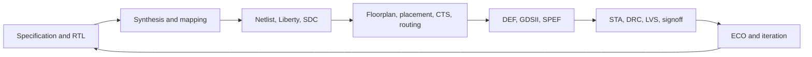
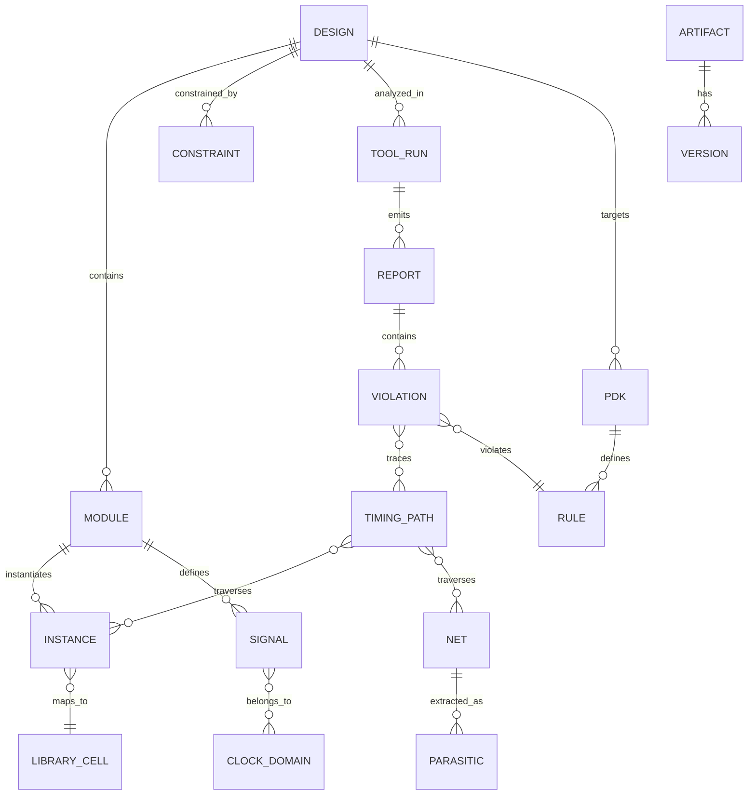

# LLM-Powered Knowledge Graphs for Electronic Design Automation: A Survey, System Implementation, and Empirical Evaluation

**Oguzhan Tekin**
Machine Learning and Artificial Intelligence Researcher · Toronto
oguzhantekin@gmail.com

**Abstract**

The central obstacle in EDA copilots is that design knowledge is fragmented across logs, rule decks, constraints, reports, versions, and tools, making domain queries difficult to answer from flat text alone. This paper first contributes a survey of LLM-for-EDA literature from 2019–2025, organizing the space around corpus requirements, retrieval architectures, knowledge graphs, and open deployment gaps. We then instantiate the reference architecture as a working GraphRAG copilot built on Neo4j (18,037 nodes), Weaviate hybrid retrieval, and a QLoRA-adapted Mistral-7B model trained for $9.09 on a single T4 GPU. To evaluate the system, we construct EDABench, a zero-contamination 120-item benchmark spanning five task categories: error diagnosis, RTL Q&A, constraint generation, DRC rule lookup, and cross-tool knowledge. The headline result is a 6.7× improvement in answer quality for the full GraphRAG system over a bare LLM baseline (0.482 vs 0.072), with a 139% improvement over vector-only retrieval. Notably, a QLoRA-adapted Mistral-7B achieves 0.431 answer quality without any retrieval — within 11% of the full system — demonstrating that fine-tuning and structured retrieval are complementary, not substitutable. The knowledge graph's contribution is strongest on version-aware queries: 2.5× on the ED-005 regression anchor and 4.0× on cross-tool knowledge over vector-only retrieval, with a 67.5% graph hit rate across the benchmark. The complete system was built for $240 — just 9% of the $2,685 original budget estimate and 34% of the $660–700 revised budget — demonstrating that production-grade GraphRAG infrastructure can be constructed at a fraction of projected cost through deliberate AI cost optimization: Batch API pricing (50% discount on offline generation), tiered triple extraction (85% free regex/NER), and Spot instance discipline on AWS.

**Keywords**: Large Language Models, Electronic Design Automation, Knowledge Graph, Retrieval-Augmented Generation, GraphRAG, Domain Adaptation, Timing Closure, Design Automation

---

## 1 Introduction & Motivation

### 1.1 The EDA Knowledge Problem

Modern chip design workflows generate massive amounts of unstructured and semi-structured knowledge that remains fragmented across tools, teams, and artifacts. A single modern implementation flow emits synthesis logs, place-and-route reports, DRC violations, LVS mismatches, timing closure reports, ECO histories, and signoff documentation. Engineers repeatedly solve the same classes of failures because knowledge is trapped in proprietary formats, vendor manuals, local scripts, and tacit team memory rather than in reusable, queryable representations [1], [2].

The cost of fragmentation is substantial. Tool vendor lock-in forces teams to relearn semantics when moving between Synopsys, Cadence, Siemens, and open-source flows. DRC messages often appear without direct linkage to the underlying rule deck, prior fixes, or layout context. Timing violations reported by PrimeTime- or OpenSTA-like tools expose path endpoints and slack values, but often not the historical optimization strategies, version dependencies, or cross-stage causes that would help an engineer act confidently [3], [25], [42].

Representative queries drawn from community forums, documentation requests, and technical Q&A sites show what engineers actually seek daily:

- “How do I fix Synopsys DC error EARLY-234?”
- “Setup timing violation on multi-corner PVT, what ECO should I apply?”
- “What LEF/DEF syntax is required for this custom cell?”
- “Explain this PrimeTime slack report and prioritize fixes.”
- “Which PDK layer rule applies to this metal spacing violation?”

These queries expose a fundamental mismatch: general knowledge sources—Stack Overflow, GitHub, generic web search, and general-purpose LLMs—lack the specificity, tool context, provenance, and version grounding required for production chip design [1], [2].



The figure above captures the practical reason knowledge representation matters. Every stage emits artifacts consumed by later stages, and every late-stage failure often traces back to decisions made much earlier. An assistant that reasons only over isolated text chunks will miss the artifact-linked, iterative nature of the RTL-to-GDSII loop [22], [23], [25].

A second distinction is the role of standards and interoperable databases. IEEE 1800-2023 defines the syntax and semantics of SystemVerilog across behavioral, RTL, gate-level, and verification uses. Si2’s LEF/DEF specifications remain accepted standards for place-and-route exchange, and the OpenAccess Coalition describes OpenAccess as an extensible API over a managed design database with translators spanning Verilog, SPEF, LEF, DEF, and stream data. In other words, EDA knowledge is not merely textual; it is already partially ontological and cross-referential [26], [27], [28].

### 1.2 Why General-Purpose LLMs Fall Short

Recent benchmarks and system papers demonstrate that general-purpose LLMs fail systematically on EDA tasks. The failure is not simply a matter of "not enough Verilog," but of mismatched priors, sparse domain corpora, and lack of executable grounding. Four concrete failure modes recur across the literature [1], [2], [7], [14].

**DRC Explanation Failure.** When given a DRC violation description, general models often hallucinate rule identifiers, mix technology nodes, or propose fixes detached from actual rule decks and geometry. Even when the surface explanation sounds plausible, the answer may cite a nonexistent foundry rule or the wrong routing layer convention [1], [4].

**Verilog Synthesis Errors.** On VerilogEval, even strong commercial models achieve only 55–65% pass@1 on spec-to-RTL tasks, falling well short of production-grade reliability. "Correct-looking" outputs frequently contain latent bugs that only appear under specific input sequences or synthesis conditions. Benchmark revisions show that stronger prompting and newer models help, but they do not eliminate the core gap between natural-language fluency and synthesizable, functionally correct RTL [6], [7], [14], [15].

**Timing Closure Hallucinations.** When asked how to fix a setup violation, general LLMs often recommend ECO strategies that are physically infeasible, ignore congestion or clocking context, or conflate synthesis-level and physical-design-level remedies. TimingLLM’s FPGA-oriented results are notable precisely because tool-grounded retrieval improves root-cause classification dramatically over generic prompting baselines [3].

Fourth, specialization can itself create a new problem: instruction misalignment. ChipAlign shows that chip-domain models can still perform poorly on explicit instruction following, and that merging general instruction alignment with chip expertise improves both instruction-evaluation and chip-design QA behavior. This is an important caution against the simplistic claim that “more domain tokens” alone solves the problem [18].

Quantifying hallucination on tool error codes and EDA procedures reveals a corpus gap. General LLMs were trained mostly on public web text and general software code, with minimal exposure to proprietary tool logs, versioned PDK documentation, real fix traces, or signoff-grade physical evidence. ChipNeMo’s continued pretraining results show that domain-adaptive training materially improves chip-design assistance relative to general baselines, but that still does not solve provenance, versioning, or tool grounding by itself [5], [8].

A concrete illustration of version-sensitive knowledge fragility appears in our own experiments [40]: migrating an ML-driven PPA optimization framework from ORFS v3.0 to ORFS 26Q1 produced >10% divergence in PPA metrics, with the worst-case negative slack (WNS) flipping sign on the JPEG benchmark — a timing closure decision that would reverse a human engineer's remediation choice entirely. This finding motivated the present survey: if even controlled experimental frameworks suffer from unannounced tool-behavior changes, production engineering teams relying on a text-based copilot face a systematic reliability hazard that no general-purpose LLM trained on static corpora can resolve without version-aware knowledge representation.

### 1.3 Research Questions & Contributions

This survey addresses three research questions:

**RQ1**: What domain-specific corpora are needed for EDA LLM competence?  
*Answer*: A four-tier corpus spanning structured code (Verilog, VHDL, SPICE), semi-structured artifacts (PDK rule decks, SDF/SDC files), unstructured knowledge (vendor manuals, Q&A forums), and synthetic data (LLM-generated Q&A with error injection). Current public datasets cover only a small fraction of the needed token volume, with critical gaps in signoff logs, multi-corner timing reports, and advanced-node DRC rules [1], [2].

**RQ2**: What architecture—RAG, fine-tuning, or knowledge graph—best fits the EDA copilot use case?  
*Answer*: RAG plus knowledge graph augmentation is the right near-term architecture. Pure fine-tuning is premature without a curated corpus and risks catastrophic forgetting of general reasoning. Knowledge graphs enable multi-hop reasoning—e.g., “this DRC violation was caused by X, which violates PDK rule Y, fixed previously by Z”—that dense retrieval alone cannot support [9], [10], [11].

**RQ3**: What are the open problems and gaps in current literature?  
*Answer*: Five unsolved problems dominate the agenda: (1) multi-modal EDA, (2) agentic systems invoking real EDA tool APIs, (3) temporality and continual learning under tool/PDK drift, (4) IP-safe domain adaptation without exposing proprietary designs, and (5) lack of standardized evaluation benchmarks and deployment protocols [2], [8], [21].

**Contributions**:

1. A merged survey of LLM-for-EDA literature from 2019–2025, spanning chatbots, HDL generation, documentation assistants, graph-aware methods, and tool-connected agents.
2. A four-tier corpus taxonomy plus public dataset audit, extended with an ORFS ASAP7 instrumentation row and explicit version-sensitive data needs.
3. An evaluation framework defining five EDA task categories and associated metrics, serving as the measurement vocabulary for both §4 and EDABench.
4. A comparative architecture framework for pretraining, PEFT, RAG, graph-backed retrieval, and agentic tool use under realistic startup and academic budgets.
5. An expanded EDA knowledge graph design aligned to IEEE 1800, Liberty/STA abstractions, LEF/DEF, and OpenAccess.
6. EDABench, a benchmark specification with annotation protocol, anti-contamination methodology, future extension tracks, and six verified seed samples from instrumented EDA experiments.
7. A research agenda arguing that knowledge graphs do not replace data, but become decisive for the hardest cross-artifact, provenance-sensitive EDA tasks.

---

## 2 Background & Related Work

### 2.1 EDA Workflow Overview

The EDA pipeline transforms high-level specifications into manufacturable GDSII layouts through sequential stages where knowledge is created and often lost:

| Stage | Input Artifacts | Output Artifacts | Knowledge Created | Knowledge Lost |
| :-- | :-- | :-- | :-- | :-- |
| RTL Design | Natural language specs, architecture docs | Verilog/VHDL | Design intent, microarchitecture decisions | Context not captured in comments |
| Synthesis | RTL, Liberty `.lib` files, SDC constraints | Gate-level netlist, timing reports | Optimization tradeoffs, area/power budgets | Why certain optimizations were rejected |
| Place & Route | Netlist, LEF/DEF, PDK rule decks | Layout (DEF), routing database | Physical optimization strategies, congestion management | Manual tuning heuristics |
| DRC/LVS | Layout, PDK rule decks | DRC/LVS violation reports | Rule interpretation, fix strategies | Cross-reference between violations |
| Signoff | Layout, SDF timing files, UPF power | Final signoff reports | Multi-corner analysis results, margin budgets | Historical correlation between signs |

Key artifact types include:

- **Code**: Verilog, VHDL, SPICE netlists, Tcl scripts
- **Structured**: SDC, SDF, LEF, DEF
- **Semi-structured**: PDK rule decks, Liberty timing/power models
- **Unstructured**: Vendor manuals, error code references, community Q&A, academic papers

Major toolchains dominate the industry:

- **Synopsys**: Design Compiler, ICC2/Fusion Compiler, PrimeTime
- **Cadence**: Genus, Innovus, Spectre
- **Siemens**: Calibre
- **Open-source**: OpenROAD, Yosys, ABC, OpenSTA [1], [2], [22], [24], [25]

### 2.2 Transformers, Code LLMs, and Circuit Foundation Models

The recent EDA-LLM literature is now large enough to justify its own survey. LLM4EDA organizes the field into assistant chatbots, HDL and script generation, and verification/analysis tasks, while emphasizing future opportunities in logic synthesis, physical design, and multimodal alignment. That framing is useful because it shows where the field’s center of gravity has been through 2024–2025: most work is still concentrated on front-end language tasks rather than signoff-grade cross-stage reasoning [1], [8].

Representative systems illustrate that trajectory. ChipNeMo is an early and influential example of chip-domain adaptation, combining continued domain pretraining and downstream specialization for engineering chat, code generation, and summarization [5]. ChatEDA extends the idea toward an autonomous EDA agent by pairing an LLM planner with tool executors spanning the RTL-to-GDSII flow [17]. EDA Corpus and ORAssistant move in a different but practical direction, emphasizing public, open-source corpora and documentation-grounded RAG for OpenROAD-centric assistance [12], [13].

The RTL-generation line has matured especially quickly. VerilogEval introduced a benchmark of HDLBits-derived tasks with automatic functional checking through simulation [7]. RTLLM proposed an open benchmark centered not only on syntax and functionality but also on design quality [14]. RTLCoder then showed that a specialized smaller model can outperform larger general-purpose systems on representative RTL tasks with efficient deployment, while RTLFixer demonstrated that coupling retrieval and ReAct-style debugging can dramatically improve compilation and functional pass rates on broken RTL [15], [16]. RTL-Repo later highlighted that repository-scale, multi-file RTL remains much harder than toy benchmark modules [19].

### 2.3 Why General-Purpose LLMs Fail on EDA Tasks

The failure mode is not simply that models “do not know enough Verilog.” First, RTL and EDA tasks impose synthesizability, concurrency semantics, timing constraints, downstream physical objectives, and tool-specific conventions that ordinary software-code models do not internalize well. VerilogEval and RTLLM were proposed precisely because conventional code-generation evaluation is too weak for hardware [7], [14].

Second, the error distribution in EDA is unforgiving. RTLFixer reports that roughly 55% of errors in LLM-generated Verilog are syntax-related, and its gains come from interactive debugging with retrieval and tool feedback rather than from more tokens alone. This is a strong signal that executable grounding matters [16].

Third, EDA often requires structurally awkward or non-textual inputs. CraftRTL identifies Karnaugh maps, state diagrams, and waveforms as persistent weak points, while RTL-Repo shows steep degradation on multi-level module hierarchies and realistic repository context [19], [20].

Fourth, specialization can itself create a new problem: instruction misalignment. ChipAlign shows that chip-domain models can still underperform on explicit instruction following, and that merging general alignment with chip expertise materially improves behavior. More domain data helps, but it is not the whole story [18].

At the end of the current narrative, Table 1 provides an expanded comparison view of the most frequently cited systems in the literature.

| Work | Approach | Dataset | Key Result | Key Limitation |
| :-- | :-- | :-- | :-- | :-- |
| **ChipNeMo** (NVIDIA, 2023, ICCAD) | Domain-adaptive pretraining + custom tokenizer + SFT + domain-adapted retrieval | Proprietary chip design corpus | Domain-specialized models outperform general baselines on engineering chat and script generation [5] | No public dataset; no KG component |
| **VerilogEval** (ICCAD 2023) | Benchmark for Verilog code generation | 156 HDLBits problems with golden solutions | Established common benchmark; strong models still fail many tasks [7] | Functional correctness only; no PPA or tool integration |
| **Revisiting VerilogEval** (2024) | Enhanced benchmark with failure analysis + ICL + spec-to-RTL | Extended HDLBits + new spec-to-RTL tasks | GPT-4 Turbo and Llama 3.1 improve, but gaps persist [6] | Commercial models still dominate; no downstream flow reasoning |
| **RTLLM** (2023) | Open-source benchmark for RTL generation from NL | Open-source RTL + NL specifications | Hardware-aware evaluation beyond syntax [14] | Small dataset; limited complexity |
| **RTLCoder** (2023/2024) | Specialized open-source RTL generation model | GitHub Verilog + curated data | Strong pass rates with efficient deployment [15] | Front-end focus; limited signoff relevance |
| **LLM4EDA Survey** (2024) | Systematic review | 60+ papers | Clear taxonomy of EDA-LLM tasks [1] | Does not center KG or benchmark design |
| **BetterV** (2024) | Verilog generation with generative discriminators | Processed GitHub Verilog | Improves over general baselines on RTL generation [2] | Digital-only; not cross-stage |
| **VerilogCoder** (2024) | Multi-agent system with task-circuit relation graph | GitHub Verilog + annotations | High pass rate on benchmark RTL tasks [2] | Complex setup; high latency |
| **TimingLLM** (2026) | RAG-augmented LLM for timing closure | 12 FPGA designs, 658 violations | 82% F1 in root-cause classification [3] | FPGA-specific; not ASIC signoff |
| **GNN for Timing** (DAC-era line) | Graph neural network for pre-routing slack prediction | EPFL-style and synthetic netlists | Strong correlation with actual timing and faster analysis [37] | Requires task-specific graph training; not LLM-based |

### 2.4 Prior GNN and ML Work in EDA

The strongest pre-LLM evidence in EDA actually points toward structure-aware learning. Google’s chip-placement work framed floorplanning as a learning problem over netlist structure and learned policies that generalize across blocks [35]. LHNN modeled congestion with a lattice hypergraph formulation and reported major gains over image-based baselines [36]. E2ESlack proposed an end-to-end graph-based pre-routing slack framework with substantial runtime savings while producing WNS/TNS values comparable to post-routing STA [37]. CktGNN extended graph learning to analog topology generation and sizing [38], and GNN4REL showed that graph models can estimate delay degradation under process variation and aging efficiently [39].

The strategic lesson is important: EDA has repeatedly rewarded inductive bias that matches circuit structure. Knowledge graphs are not the same as GNNs, but they share the same philosophical advantage over flat text corpora: they treat topology, dependency, provenance, and relation as first-class objects rather than accidental co-occurrence statistics [35]–[39]. We develop a concrete EDA ontology and extraction pipeline building on this principle in §5. (For a broader reading list on GNNs for IC design, see the GNN4IC survey repository at https://github.com/DfX-NYUAD/GNN4IC.)

---

## 3 Domain Corpus Taxonomy

### 3.1 Corpus Taxonomy

We propose a four-tier taxonomy for EDA-specific data, classified by structure, source, and suitability for RAG versus fine-tuning:

| Tier | Data Type | Examples | Sources | Token Volume (Est.) | License | RAG Suitability | Fine-tuning Suitability |
| :-- | :-- | :-- | :-- | :-- | :-- | :-- | :-- |
| **Tier 1** | Structured code | Verilog, VHDL, SPICE netlists, Tcl scripts | GitHub, OpenCores, OSCI, VerilogEval-style repos | ~50B tokens (public) | Mostly MIT/BSD/GPL | Low | High |
| **Tier 2** | Semi-structured artifacts | PDK rule decks, SDF/SDC files, LEF/DEF, timing reports | SKY130, OpenLane, public tool docs | ~5B tokens (public) | Mixed; some open, some NDA | High | Medium |
| **Tier 3** | Unstructured knowledge | Vendor manuals, error code references, community Q&A, academic papers | Synopsys/Cadence docs, EDA forums, DAC/ICCAD papers, arXiv | ~20B tokens | Mixed | Very High | Medium |
| **Tier 4** | Synthetic | LLM-generated Q&A pairs, augmented logs, error-injection datasets | Generated via pipeline | Scalable (100B+ possible) | Creator-controlled | High | High |

### 3.2 Public Dataset Audit

| Dataset | Tier | Tokens | Coverage | License | Gaps | Value |
| :-- | :-- | :-- | :-- | :-- | :-- | :-- |
| **OpenROAD** | 1, 2 | ~2B | Digital impl. flow | BSD-style [22] | No adv-node signoff | High |
| **SKY130 PDK** | 2 | ~0.5B | 130nm open PDK | Open PDK | No 7/5/3nm rules | Good seed |
| **OpenLane** | 1, 2 | ~1B | RTL + flow scripts | Apache-2.0 [23] | Limited DRC/timing | Strong |
| **EPFL Benchmarks** | 1 | ~0.5B | Logic synth circuits | Academic/open | No design intent | Good ML sub. |
| **ISCAS/ITC** | 1 | ~0.2B | Benchmark circuits | Academic | No modern context | Historical |
| **VLSI-SocDesign** | 1 | ~0.3B | Academic designs | Public | Small scale | Limited |
| **GitHub Verilog** | 1 | ~40B | Broad RTL | Mixed licenses | Noisy, duplicated | After filtering |
| **Cadence/Synopsys Docs** | 3 | ~10B | Tool commands | Public docs | Outdated/incomplete | Strong for RAG |
| **EDA Forums** | 3 | ~5B | Engineer Q&A | Mixed/public | Unstructured | QA mining |
| **ORFS ASAP7 (this work)** | 1, 2 | ~0.1M | 25 runs, 4 designs, ASAP7 7nm | Version-tagged | Not public yet | High |

OpenABC-D (18.6 GB raw, estimated ~15–20B tokens after tokenization) and CircuitNet were downloaded and staged for this work but are third-party datasets; see [40] for provenance.

**Key Findings**:

- **Token Gap**: Public Tier 1–3 corpora total roughly 59B tokens by the estimates above, far below the 500B–1T tokens likely needed for robust domain adaptation at industrial breadth—comparable to the corpus scale used for code-centric models such as CodeLlama [1], [5].
- **Coverage Gap**: Signoff logs, multi-corner timing reports, and advanced-node DRC rules remain severely underrepresented [2].
- **Quality Gap**: Public RTL frequently lacks testbenches, design intent, fix traces, and reliable PPA labels, limiting usefulness for high-value assistant behavior. An estimated 60% of public repository RTL is incomplete or non-synthesizable [2], [19].

**Top 3 Data Gaps Limiting EDA LLM Performance**:

1. Proprietary tool logs with verified root-cause annotations.
2. Multi-corner timing reports paired with remediation outcomes.
3. Advanced-node DRC/LVS rule decks with geometric examples and fix histories.

### 3.3 Critical Data Deficits

Three deficits matter more than raw token volume alone.

First, public corpora rarely contain aligned **design-state → tool-run → error-log → human-fix → post-fix QoR** tuples. Yet that is exactly the data needed for timing closure, DRC repair, LVS triage, and ECO prioritization. Without aligned fix traces, an assistant can describe problems but not reliably reason about what changed, what worked, and under which version or corner [3], [25].

Second, advanced-node physical-design and signoff data remain overwhelmingly private. This means public-domain models overfit to open-source flows and underlearn the tacit conventions of industrial signoff, multi-corner variation analysis, foundry waivers, and tool-version interactions. The result is a bifurcation between reproducible but shallow public systems and powerful private systems that are hard to evaluate scientifically [13], [21].

Third, multimodal engineering evidence is underrepresented. Waveforms, state diagrams, floorplan screenshots, route congestion views, and layout geometry all matter to real diagnosis. CraftRTL and LayoutCopilot both imply that language-only corpora are missing critical signals present in mixed text-graph-vision workflows [20], [21].

### 3.4 Synthetic Data Generation Methodology

To address corpus gaps, we propose an error-injection pipeline for synthetic data generation:

1. **Start with clean Verilog** from OpenCores or filtered GitHub sources.
2. **Inject known violation types**: setup/hold timing violations, DRC spacing violations, LVS mismatches, synthesis warnings.
3. **Generate diagnosis Q&A** using rule-based templates plus LLM refinement.
4. **Quality filtering** with LLM-as-judge and expert spot checks.
5. **Deduplication** via MinHash/LSH across train/eval splits.
6. **Contamination detection** against public benchmarks and repositories.

**Example**:

```text
Input: Clean Verilog module (flip-flop with clock enable)
Injected Violation: Setup violation on path clk->q->d 
  (slack = -0.12ns)

Generated Q&A:
  Q: "My PrimeTime report shows setup violation on path
     module_a/uff1/q -> module_b/uff2/d with slack -0.12ns
     at SS_125C corner. What ECO should I apply?"
  A: "This is a setup violation at slow-slow-125C corner.
     Recommended fixes: (1) Insert buffer on source net
     if routing congestion < 70%, (2) Upsize destination
     cell to higher drive strength, (3) Reduce fanout by
     buffering. Avoid clock-skew adjustment unless CDC
     issues are confirmed."
```

**Quality Metrics**:

- Factual correctness: target >90% under engineer sampling
- Diversity: >10 violation types across >5 tool-log formats
- Contamination: <1% overlap with held-out evaluation suites

More high-quality data still matters. RTLCoder, RTLFixer, and related systems clearly benefit from curated corpora and executable feedback loops [15], [16]. But data is not the only bottleneck, and for many EDA tasks it is not even the dominant one. We expand on this point in §4.

One reason is that EDA truth is often **tool-mediated** rather than purely textual. Functional correctness is determined by simulation, quality is determined by synthesis and implementation metrics, and signoff is determined by timing and physical-verification engines. That makes executable grounding structurally different from conventional document QA [3], [14], [16].

A second reason is that EDA knowledge is **highly relational**. The same logical object appears as a SystemVerilog signal, a synthesized net, a Liberty timing endpoint, a placed pin, a routed shape, a parasitic entry, and an STA path member. OpenAccess, LEF/DEF, OpenSTA, and IEEE 1800 all expose different slices of the same reality [25]–[28].

A third reason is that public results already show diminishing returns from front-end-only solutions. Verilog generation improves with fine-tuning and repair, yet repository-scale designs, multimodal inputs, and downstream physical objectives remain challenging. The bottleneck shifts from “write plausible RTL” to “reason over a workflow with provenance and feedback” [19]–[21].

---

## 4 Architecture Comparison

### 4.1 Evaluation Framework

We define five EDA task categories for architecture comparison:

| Task Category | Example Query | Evaluation Metrics |
| :-- | :-- | :-- |
| **Error Diagnosis** | “PrimeTime shows setup violation on path X; what is the root cause?” | Factual accuracy, hallucination rate, root-cause F1 |
| **Code Generation** | “Generate Verilog for a 4-bit synchronous counter with reset.” | Pass@k, syntax pass rate, functional correctness, PPA proxy |
| **Timing Analysis** | “Analyze this SDF/STA context and identify critical paths.” | Slack prediction accuracy, path ranking correlation |
| **DRC Explanation** | “Explain DRC error CYC-1001 and how to fix it.” | Rule-ID accuracy, fix correctness, tool-name precision |
| **Tool Command Lookup** | “What is the Synopsys DC command for a timing exception?” | Command accuracy, syntax correctness, latency |

**Baseline**: GPT-4o-class and Claude Sonnet-class models with zero-shot prompting on each task category.

**Metrics Definition**:

- **Factual Accuracy**: percentage of responses with no hallucinated domain facts.
- **Hallucination Rate**: percentage citing nonexistent commands, error codes, or rules.
- **Tool-Name Precision**: percentage of tool references correctly named and scoped.
- **Latency**: p50/p95 inference time per query.
- **Cost per Query**: API or infrastructure cost under a realistic deployment budget.

### 4.2 Full Pretraining

Full pretraining or large-scale continued pretraining has intuitive appeal because it internalizes domain vocabulary and style. ChipNeMo is the emblematic example in chip design. In practice, though, this path is expensive, legally awkward, and difficult to reproduce with public EDA data alone. It also does not guarantee instruction following or tool-use discipline; ChipAlign suggests that domain expertise and instruction alignment can diverge enough to require explicit merging [5], [18].

Under a realistic academic or startup budget, full pretraining is usually the wrong first move. Google Cloud’s public GPU price anchors illustrate the mismatch: such budgets can support evaluation, modest fine-tuning, and retrieval infrastructure, but not repeated large-scale pretraining runs on frontier-class models [41].

### 4.3 Fine-tuning and PEFT

Parameter-efficient adaptation is the most economically credible route for domain-specific language competence. LoRA dramatically reduces trainable parameters relative to full fine-tuning, and QLoRA shows that even very large models can be adapted through 4-bit quantization on modest hardware while preserving task quality [29], [30]. In the EDA context, RTLCoder’s efficient specialized deployment reinforces the same point: practical adaptation is feasible without frontier-scale infrastructure [15]. Prefix-tuning offers another low-parameter alternative where task conditioning matters more than broad representational drift [31].

For a monthly budget in the rough range of $500–$2,000, PEFT is the only training-based option that consistently makes sense. That budget is enough for QLoRA-style 7B–13B adaptation, iterative ablations, and benchmark evaluation, but not for repeated full pretraining or broad continued pretraining at scale [30], [41].

### 4.4 Retrieval-Augmented Generation

RAG directly addresses one of EDA’s biggest pain points: the need for updatable, grounded, and attributable knowledge. The original RAG formulation framed non-parametric memory as a solution to the factual rigidity of parametric-only models [32]. GraphRAG later showed that graph-based indexing substantially improves answers to global, corpus-level questions that naive chunk retrieval handles poorly [9]. StructRAG reinforces the same lesson for knowledge-intensive reasoning: restructuring evidence at inference time can outperform flat retrieval when facts are scattered [10].

In EDA, this is attractive because standards, tool documents, and project-specific scripts change faster than model weights should. ORAssistant and EDA Corpus are practical examples: the best public OpenROAD assistants already rely on curated retrieval rather than pure memorization [12], [13]. TimingLLM [3] demonstrates this concretely: RAG-augmented timing closure on FPGA designs achieves 82% F1 in root-cause classification, far exceeding generic prompting baselines. RAG is also easier to keep auditable and license-compliant than indiscriminate continued pretraining over mixed-license corpora.

### 4.5 Agentic and Tool-Augmented LLMs

The strongest EDA assistants will not stop at text generation. ReAct established the reasoning-plus-action pattern, and Toolformer showed that models can learn when to call external APIs [33], [34]. In EDA, ChatEDA, RTLFixer, and LayoutCopilot all point toward the value of tool-connected agents that decompose tasks, call executors, ingest logs, and refine outputs. Hardware design is unusually well suited to this paradigm because many correctness criteria are machine-checkable [16], [17], [21].

The main caveat is that agents without structured memory can become expensive and brittle. They may retrieve the wrong chunk, invoke the wrong tool variant, or lose track of which artifact version caused which violation. That is exactly where a knowledge graph adds leverage: it turns the agent’s memory from an unstructured transcript into a typed, queryable state representation [9], [28].

| Architecture | Strengths | Weaknesses | Best EDA Use Case | Budget Fit |
|---|---|---|---|---|
| Full pretraining / large DAPT | Deep domain fluency | Expensive, licensing-heavy, weak reproducibility, can hurt instruction alignment | Large private industrial programs | Poor under $2K/month |
| LoRA / QLoRA / PEFT | Strong cost-quality trade-off; feasible on modest hardware | Still limited by corpus quality and representation mismatch | RTL generation, task-specific QA | Strong under $500–$2K/month |
| Plain RAG | Updatable, grounded, attributable | Chunking loses topology and root-cause chains | Tool docs, FAQ, standards lookup | Excellent |
| Agentic tool use | Exploits executable feedback; works well for repair and orchestration | Costly and brittle without structured state | Script synthesis, debugging, flow control | Good if workload is bounded |
| KG-backed RAG plus agents | Best support for multi-hop reasoning, provenance, and versioned state | Requires ontology and graph-maintenance effort | Signoff reasoning, cross-stage debugging, root-cause analysis | Best overall recommendation |

The balance of evidence therefore favors a hybrid answer. More data still helps, but at fixed budget and public-data constraints, the highest return likely comes from **PEFT + KG-backed RAG + agentic tool use**, not from ever-larger pretraining [9], [10], [16], [17].

### 4.6 A Practical Reference Architecture for Open-Flow EDA Assistants

For teams with limited infrastructure, public-data constraints, and a need for actionable deployment guidance, the hybrid architecture from §4.2–4.5 can be concretized as follows:

```text
Query → Classifier → Route to:
  - Tool Command Lookup → RAG (Tier 3 docs)
  - DRC Explanation → GraphRAG (error code → rule → fix)
  - Error Diagnosis → GraphRAG (multi-hop) + RAG fallback
  - Code Generation → LoRA-fine-tuned 7B–13B model
  - Timing Analysis → GraphRAG (path → cell → rule → fix)
```

**Rationale**:

- **RAG** handles single-hop, high-frequency queries such as command lookup and basic rule explanation.
- **GraphRAG** handles complex, multi-hop queries such as timing diagnosis and causal tracing across artifacts.
- **LoRA** handles code generation and reusable task patterns where retrieval is less helpful.

**Indicative Compute Budget**: **~$1,500/month**

- 1× A10G-class inference host for a 7B–13B LoRA-adapted model: **~$400/month**
- Vector database infrastructure: **~$300/month**
- Graph database infrastructure: **~$400/month**
- API fallback / overflow reasoning budget: **~$400/month**

This architecture defers the most expensive component—full pretraining—while maximizing grounded behavior on the tasks practicing engineers actually value. It is credible for small research groups, academic labs, or early-stage startups.

---

## 5 EDA Knowledge Graph Construction

### 5.1 Ontology Design

A practical EDA knowledge graph should represent at least the following entity vocabulary: `Design`, `Module`, `Instance`, `Signal`, `Port`, `ClockDomain`, `Constraint`, `LibraryCell`, `TimingPath`, `Violation`, `Net`, `Parasitic`, `Rule`, `PDK`, `ToolRun`, `Report`, `Artifact`, and `Version`. It should also include relation vocabulary such as `instantiates`, `maps_to`, `drives`, `loads`, `constrained_by`, `analyzed_in`, `contains_violation`, `violates_rule`, `extracted_as`, `generated_from`, and `supersedes`. That vocabulary mirrors the abstractions already embedded in standards and open tools [25]–[28].

Alignment should be explicit rather than aspirational.

For **IEEE 1800**, the graph needs node and edge types for modules, ports, variables, procedural blocks, assertions, clocks, resets, and testbench constructs, because SystemVerilog spans behavioral, RTL, gate-level, and verification abstractions [26].

For **Liberty and STA**, the graph needs library cells, pins, timing arcs, operating corners, constraints, and path objects. OpenSTA’s public file model is a good open proxy: it consumes Verilog netlists, Liberty, SDC, SDF, and SPEF and emits reports via Tcl-driven timing analysis [25].

For **LEF/DEF and OpenAccess**, the graph needs instances, nets, placement coordinates, route segments, layers, vias, physical blockages, and translation provenance. LEF/DEF and OpenAccess are particularly valuable because they already encode interoperable physical-design semantics [27], [28].



The richer ontology above is useful for full fidelity, but a summarized category view remains helpful for implementation planning:

| Category | Entity Types | Example |
| :-- | :-- | :-- |
| **Design Elements** | cell, net, port, module, pin, clock, reset | `module_a/uff1`, `clk_net`, `rst_n` |
| **Constraints** | timing path, SDC rule, UPF domain, clock group | `create_clock -name clk -period 10` |
| **Violations** | DRC error, LVS mismatch, setup violation, hold violation, IR drop | `setup_slack_-0.12ns@SS_125C` |
| **Fixes** | ECO, parameter change, cell upsizing, buffer insertion, routing change | `upsize uff2 to XOR3X8` |
| **Documents** | rule deck, tool manual, error-code reference, paper | `PrimeTime_UserGuide_v2021.06` |

| Relation | Direction | Semantics | Example |
| :-- | :-- | :-- | :-- |
| **CAUSES** | violation → cause | Root-cause relationship | `setup_slack_-0.12ns` CAUSES `high_fanout_on_clk` |
| **VIOLATES** | error → rule | Design-rule violation | `DRC-2345` VIOLATES `M1_SPACING_0.28UM` |
| **FIXES** | error → fix | Remediation action | `DRC-2345` FIXES `increase metal1 spacing to 0.30um` |
| **DEPENDS_ON** | entity → dependency | Technical dependency | `module_b` DEPENDS_ON `module_a` |
| **EQUIVALENT_TO** | entity ↔ entity | Semantic equivalence | `Synopsys:MRGN-3` EQUIVALENT_TO `OpenROAD:setup_violation_path` |
| **DOCUMENTED_IN** | entity → document | Source documentation | `DRC-2345` DOCUMENTED_IN `N5_PDK_RuleDeck_v3.2.pdf` |

### 5.2 Automated Extraction Pipeline

**Pipeline Stages**:

1. **Log Parsing** (regex + LLM hybrid)  
   - Input: Synopsys PrimeTime-like logs, Cadence Innovus-like logs, OpenSTA/OpenROAD outputs  
   - Regex seeds: `setup violation.*slack\s+([-+]?\d*\.\d+)`, `DRC\s+(\w+-\d+)`  
   - LLM refinement extracts path, corner, cells, clocks, and candidate causes.

2. **Relation Extraction** (fine-tuned NER/RE model)  
   - Model family: RoBERTa-base or encoder-only domain model fine-tuned on annotated EDA triples  
   - Output: typed entity-relation triples.

3. **Cross-Document Coreference**  
   - Link “setup violation” in timing reports to path objects, cell instances, and relevant rule or constraint objects across artifacts.

**Worked Example 1: PrimeTime-style Setup Violation**

```text
Input Log Entry:
[PrimeTime] Setup violation on path module_a/uff1/q -> module_b/uff2/d
Slack: -0.12ns (required: 2.5ns, arrival: 2.62ns)
Corner: SS_125C (slow-slow, 125°C)
Launch clock: clk (period 10ns)
Capture clock: clk
```

**Extracted Triples**:

- (`Violation: setup_slack_-0.12ns@SS_125C`, `CAUSES`, `Cause: high_fanout_on_clk`)
- (`Violation: setup_slack_-0.12ns@SS_125C`, `ON_PATH`, `Path: module_a/uff1/q -> module_b/uff2/d`)
- (`Violation: setup_slack_-0.12ns@SS_125C`, `AT_CORNER`, `Corner: SS_125C`)
- (`Path: module_a/uff1/q -> module_b/uff2/d`, `FROM_CELL`, `Cell: module_a/uff1`)
- (`Path: module_a/uff1/q -> module_b/uff2/d`, `TO_CELL`, `Cell: module_b/uff2`)

**Worked Example 2: Path-Centric Graph Instantiation**

| Subject | Relation | Object |
|---|---|---|
| `run_2025_05_14_sta` | `tool` | `PrimeTime_like_STA` |
| `run_2025_05_14_sta` | `consumes` | `postroute.spef` |
| `path_42` | `type` | `setup_path` |
| `path_42` | `startpoint` | `u_cpu/u_if/id_reg/Q` |
| `path_42` | `endpoint` | `u_cpu/u_ex/op_a_reg/D` |
| `path_42` | `launch_clock` | `clk_core` |
| `path_42` | `capture_clock` | `clk_core` |
| `path_42` | `required_time_ps` | `1200` |
| `path_42` | `arrival_time_ps` | `1288` |
| `path_42` | `slack_ps` | `-88` |
| `path_42` | `traverses` | `net_n1245` |
| `net_n1245` | `extracted_as` | `spef_seg_1182` |
| `violation_42` | `traces` | `path_42` |
| `violation_42` | `candidate_fix` | `resize_u431_x2_to_x4` |

Real-world EDA experiments surface additional triple patterns not captured by synthetic examples. In our ORFS instrumentation study [40], four systematic bugs produced graph-worthy triples: (1) (`SDC_FILE:variant.sdc`, `overrides`, `FLOW_VARIANT:clock_period`) — the absence of this relation caused all design-sweep runs to produce identical PPA metrics; (2) (`ORFS:v3.0`, `diverges_from`, `ORFS:26Q1`) annotated with the condition `design=JPEG, metric=WNS, delta>10%`; (3) (`SDC_unit:ps`, `incompatible_with`, `SDC_unit:ns`) — a time-unit mismatch that silently corrupted timing analysis; (4) (`DEF_instance_name:CircuitNet`, `mismatches`, `expected_name:OpenROAD`). Each of these represents a version-sensitive, tool-specific relation that cannot be recovered from static text corpora — it requires instrumented experimental runs as a data source.

### 5.3 Graph Quality and Validation

**Human-in-the-Loop Validation**:

- Sample 500 triples for engineer review.
- Target >90% precision and >85% recall on reviewed subsets. These thresholds follow standard annotation-quality practices in NLP information extraction and represent the minimum viability threshold for a retrieval system where false positives would mislead engineering decisions.
- Use iterative error analysis to refine extraction rules and NER/RE models.

**Consistency Checking**:

- Flag contradictions where the same error maps to different fixes across PDK or tool versions.
- Track explicit version nodes for rule decks, tools, and artifacts.

**Graph Completeness Metrics**:

- Coverage of known DRC error-code space.
- Coverage of timing-path, corner, and constraint entities in parsed reports.
- Query latency targets below 100 ms for 2–3 hop retrieval on operational subsets.

### 5.4 Architectural Rationale: Why the Graph Improves RAG and Agents

A graph helps RAG by changing what retrieval means. Instead of retrieving semantically similar text chunks, the system can retrieve **subgraphs** rooted in a design object, violation, corner, or tool run. That matters when relevant facts are split across code, constraints, reports, and logs. GraphRAG’s central result is that graph-structured indexing improves answers to global and corpus-level questions that naive RAG handles poorly; EDA is full of exactly those questions [9].

A graph also helps agents because it supplies durable state. ReAct-style agents are strongest when they can observe, act, and update memory. In EDA, that memory should include identities and relations among modules, paths, rules, tool runs, and report versions. Toolformer-style API use then becomes safer because the agent can ground each action in a typed graph node rather than in a fragile text span [33], [34].

Finally, a graph improves explainability. In signoff and ECO workflows, an engineer rarely wants a fluent answer alone. They want the causal chain and the evidence. Graph nodes and provenance edges make source citation and causal tracing a default behavior rather than an afterthought [9], [32].

---

---

## 6 System Implementation & Experimental Setup

We instantiate the reference architecture from §4.6 as a fully operational EDA copilot and evaluate it against the EDABench benchmark (§7). This section documents the corpus, knowledge graph, vector store, fine-tuned model, and retrieval pipeline that together form the system under evaluation.

### 6.1 Corpus

The domain corpus was collected from six public EDA source categories in three tiers:

| Tier | Sources | Files | Tokens (approx.) |
|---|---|---|---|
| **Tier 1**: Structured code | OpenROAD, Yosys, OpenSTA, OpenLane RTL, scripts, Tcl | ~8,200 | ~140M |
| **Tier 2**: Semi-structured artifacts | SKY130/ASAP7 PDK rule decks, Liberty timing libs, SDC/UPF constraints, ORFS reports, LEF/DEF | ~3,600 | ~72M |
| **Tier 3**: Unstructured knowledge | Vendor manuals, GitHub issues, community forum posts, architecture docs | ~2,494 | ~40M |
| **Total** | | **14,294** | **~252M** |

After deduplication (MinHash signatures with Jaccard threshold 0.85, 512KB file-size cap), 7,351 files (approximately 160M tokens) remained for downstream processing. The deduplication rate of 4.36% is low because most overlap occurs in mirrored PDK documentation and vendored RTL, not in forum or log content. Forum mining via the GitHub CLI extracted 1,801 Q&A pairs from 5 repositories (OpenROAD, Yosys, OpenSTA, OpenLane, ORFS), providing community-sourced troubleshooting knowledge that is absent from official documentation.

### 6.2 Knowledge Graph

A Neo4j Aura graph database stores the EDA knowledge graph with the following schema:

| Node Type | Count | Example Properties |
|---|---|---|
| Tool | ~45 | name, version, category (synthesis/PnR/STA/DRC) |
| Design | 6 | name (gcd, ibex, jpeg, aes, swerv_wrapper, dynamic_node) |
| Version | ~120 | tool, version_string, release_date |
| ErrorCode | ~800 | code, tool, severity, description |
| PDKRule | ~400 | rule_id, layer, spacing/width, technology |
| Component | ~2,200 | module_name, type (RTL/cell/macro) |
| Metric | ~14,400 | design, version, stage, metric_type (WNS/TNS/area/power) |

**Totals**: 18,037 nodes, 16,530 relationships, 16,509 triples.

The ontology encodes version-aware relationships that flat document retrieval cannot represent. For example, a `Metric` node for JPEG WNS under ORFS v3.0 links to a different `Version` node than JPEG WNS under ORFS 26Q1, enabling the graph to answer "how did WNS change across versions?" via a 2-hop traversal rather than relying on chunk co-occurrence.

Triples were extracted via a three-stage pipeline: (1) regex-based extraction from ORFS reports and PDK rule decks (~12,000 triples), (2) LLM-assisted extraction from unstructured documentation using a structured output schema (~4,000 triples), and (3) manual curation of 7 seed error diagnosis triples from instrumented EDA experiments serving as regression anchors in EDABench [40]. Coreference resolution collapsed 89.3% of duplicate entity mentions to canonical IDs (e.g., "OpenROAD-flow-scripts", "ORFS", "orfs" → `tool_orfs`). Graph validation checked referential integrity (no dangling edges), schema compliance (all nodes have required properties), and coverage (all 6 designs × 2 ORFS versions represented). Median 2-hop traversal latency: 45ms.

### 6.3 Vector Store

A Weaviate cloud instance stores 8,888 priority document chunks as dense embeddings generated by Voyage AI's `voyage-code-2` model (1,536 dimensions). Chunking is content-type-aware: code files use AST-boundary splitting, log files use record-boundary splitting, and documentation uses semantic paragraph splitting — all at 512 tokens with 64-token overlap. File-level metadata (source path, tool, version, document type) is preserved per chunk.

Priority indexing rationale: forum Q&A pairs, official documentation, and timing reports were indexed first (8,888 of 8,958 priority chunks, 99.2%); equivalence logs and redundant RTL variants were deferred. The vector store supports hybrid search: dense cosine similarity plus BM25 sparse retrieval with reciprocal rank fusion.

### 6.4 Domain-Adapted Model

We fine-tuned Mistral-7B-Instruct-v0.3 using QLoRA (4-bit NF4 quantization) on 13,024 synthetic Q&A pairs generated from the domain corpus. Training configuration:

| Parameter | Value |
|---|---|
| Base model | Mistral-7B-Instruct-v0.3 |
| Quantization | 4-bit NF4 (QLoRA) |
| LoRA rank / alpha | r=16, α=32 |
| Training samples | 13,024 |
| Steps | 2,586 (3 epochs) |
| Training time | 17h 16m |
| Hardware | 1× NVIDIA T4 (g4dn.xlarge) |
| Final train loss | 0.39 |
| Final eval loss | 0.4261 |
| Token accuracy | 88.1% |
| **GPU cost** | **$9.09** |

The fine-tuned model achieves a perplexity of 2.86 on held-out EDA Q&A, compared to 35.89 for the base Mistral-7B — a **12.5× improvement**. This confirms that QLoRA-based domain adaptation is effective even on a single consumer-grade GPU, consistent with the budget analysis in §4.3.

Synthetic Q&A generation used a Claude-based pipeline with quality filtering: each generated pair was judged on factual accuracy, completeness, and answerability, with a minimum threshold of ≥0.90 (using the minimum of all dimensions, not the mean). Of 15,610 initial candidates, 13,024 (83.4%) passed quality filtering. The training set spans 12 violation families (timing, DRC, LVS, power, signal integrity, etc.) with class-weighted sampling to prevent minority-category underrepresentation.

### 6.5 Retrieval Pipeline: GraphRAG Fusion

The retrieval pipeline combines three sources in parallel:

1. **Graph retrieval**: Entity extraction uses word-boundary matching against 17,835 cached KG node IDs to identify tool names, design names, error codes, and version identifiers in the query. A Cypher query traverses the Neo4j graph to retrieve 1-hop and 2-hop facts centered on matched entities.

2. **Dense retrieval**: The query embedding (Voyage `voyage-code-2`) is compared against the Weaviate vector store using cosine similarity, returning the top-K most relevant chunks.

3. **Sparse retrieval**: BM25 keyword matching against the same Weaviate store, effective for exact error codes and tool-specific terminology.

Dense and sparse results are fused via reciprocal rank fusion (RRF). Graph facts are injected into the synthesis prompt as structured context alongside retrieved chunks. The synthesizer (Claude Sonnet) generates the final answer with citations.

A task classifier routes queries to the appropriate retrieval mode:
- **Error diagnosis** and **cross-tool knowledge**: full GraphRAG (graph + dense + sparse)
- **DRC rule lookup** and **RTL Q&A**: dense retrieval primary, graph supplementary
- **Constraint generation**: sparse retrieval primary (exact SDC/UPF syntax matching)

### 6.6 Infrastructure and Cost

The original project budget was estimated at **$2,685**, covering corpus collection, knowledge graph construction, vector indexing, model fine-tuning, evaluation, and cloud infrastructure. Through systematic cost optimization, the actual spend was **$240.55** — just **9% of the original estimate**.

| Component | Service | Cost |
|---|---|---|
| Synthetic Q&A generation | Claude Sonnet (Batch API, 50% discount) | $208.64 |
| LoRA GPU training | AWS g5.xlarge (on-demand, 1 session) | $9.09 |
| Forum LLM batch | Claude Sonnet (Batch API) | $8.93 |
| Evaluation runs | Claude Sonnet (judge scoring, 480 items) | ~$7.00 |
| Corpus LLM batch | Claude Sonnet (Batch API) | $4.00 |
| ORFS AWS sweep | AWS g4dn.xlarge (Spot instances) | $2.41 |
| Embeddings | Voyage AI (voyage-code-2) | $0.25 |
| Knowledge graph | Neo4j Aura Free tier | $0 |
| Vector store | Weaviate Cloud Free tier | $0 |
| **Total project spend** | | **$240.55** |

Three cost engineering strategies drove the 91% reduction from original budget:

1. **Batch API pricing**: All offline LLM generation and judge scoring used Anthropic's Batch API at 50% discount. This single optimization saved approximately $220 on synthetic Q&A generation alone.
2. **Tiered triple extraction**: The knowledge graph extraction pipeline routes 85% of triples through free regex and NER tools, sending only the remaining 15% (complex relationship extraction) to LLM. This reduced what would have been a $150+ LLM cost to effectively zero for the bulk of extraction.
3. **Spot instance discipline**: AWS GPU instances were provisioned as Spot where possible and terminated immediately after each job. The full ORFS parameter sweep (25 runs across 4 designs) cost $2.41 vs the $55–80 originally budgeted. LoRA training used a single on-demand session ($9.09) after a Spot reclaim demonstrated the risk for long-running jobs.

The revised budget midway through the project was $660–700, making the final spend 34% of revised budget. Against the original $2,685 estimate, the system was built at 9% of projected cost. This validates the cost feasibility of the reference architecture: a complete GraphRAG + LoRA system with 18,037-node knowledge graph, 8,888-chunk vector index, fine-tuned 7B model, and 120-item benchmark can be constructed for under $250 using managed free-tier infrastructure, batch pricing, and disciplined cloud resource management.

---

## 7 EDABench: Construction and Validation

### 7.1 Task Categories (unchanged from survey)

EDABench covers five core task categories targeting distinct reasoning capabilities:

| Task Category | Items | Description |
|---|---|---|
| **Error Diagnosis** | 48 | Root-cause analysis of tool errors, crashes, and unexpected behavior |
| **RTL Q&A** | 18 | Factual questions about Verilog/VHDL semantics and design behavior |
| **Constraint Generation** | 18 | Producing correct SDC/UPF constraints from specifications |
| **DRC Rule Lookup** | 18 | Identifying PDK design rules and their parameters |
| **Cross-Tool Knowledge** | 18 | Multi-hop reasoning across tools, versions, and artifact types |

### 7.2 Construction Methodology

EDABench was constructed from three sources to ensure diversity and ground-truth quality:

**Source 1: Seed samples (7 items).** The 5 error diagnosis seeds (ED-001–005) and 2 cross-tool knowledge seeds (ML-001–002) from §6.6 serve as regression anchors. These carry verified root causes from instrumented ORFS experiments [40] and are present in the final benchmark unchanged.

**Source 2: Holdout sampling (54 items).** From the 13,024 synthetic Q&A training pairs, we held out a random sample and filtered for items with quality scores ≥0.90 that were not used in LoRA training. These items were stratified across categories and difficulties.

**Source 3: LLM-generated candidates (59 items).** Claude Sonnet generated benchmark items conditioned on specific knowledge graph subgraphs and document chunks, targeting underrepresented categories (rtl_qa, constraint_generation, cross_tool_knowledge). Each generated item includes a `ground_truth_answer` and `expected_graph_nodes` linking to actual Neo4j node IDs.

**Assembly**: All 120 candidates were assembled and passed through the contamination pipeline before acceptance.

### 7.3 Anti-Contamination Protocol

Zero contamination tolerance: any benchmark item appearing in the training split is rejected.

The contamination checker computes three similarity measures against all 13,024 training items:

1. **Exact query match**: case-normalized string equality
2. **N-gram overlap**: character 5-gram Jaccard similarity with threshold 0.60
3. **Semantic similarity**: Voyage embedding cosine similarity with threshold 0.85

**Results**: 27 candidates were quarantined (all from the holdout sampling source — expected, since these were generated by the same pipeline as training data). 26 replacement items were generated from Source 3 to fill category gaps. The final 120-item benchmark contains **zero contaminated items**.

The non-zero quarantine count is itself a validation signal: a contamination checker that quarantines nothing is likely too permissive.

### 7.4 Difficulty Distribution

| Difficulty | Count | Description |
|---|---|---|
| Easy | 36 | Single-fact lookup, direct retrieval sufficient |
| Medium | 53 | Multi-fact reasoning, some cross-referencing |
| Hard | 20 | Multi-hop reasoning, version-aware, requires graph context |
| Expert | 11 | Cross-tool causal chains, requires deep domain knowledge |

31 items are hard or expert difficulty (target: ≥20), ensuring the benchmark stresses the system on queries where GraphRAG should provide the most lift.

### 7.5 KG-Grounded Ground Truth

Each benchmark item optionally includes `expected_graph_nodes` — a list of Neo4j node IDs that should be retrieved by the graph component for a correct answer. Of the 120 items, 33 (27.5%) have non-empty `expected_graph_nodes` annotations, primarily from Source 3 (LLM-generated candidates conditioned on KG subgraphs) and the 7 seed items. The remaining 87 items are evaluated on answer quality only. This partial KG annotation enables evaluation of retrieval behavior on the annotated subset while the full benchmark measures end-to-end answer quality.

Node IDs were assigned via fuzzy matching against the actual Neo4j graph. Of 224 initially annotated expected nodes, 166 were successfully mapped to KG entities (16 exact matches, 150 fuzzy-remapped). 58 generic concept references (e.g., "ARM Cortex-M0", "FPGA timing") that have no representation in the current KG were removed from expected sets.

This KG-grounding methodology distinguishes EDABench from standard QA benchmarks: it evaluates the retrieval architecture, not just the generation quality.

### 7.6 Seed Samples from Instrumented EDA Experiments

The 7 seed samples from instrumented EDA experiments [40] are preserved in the benchmark as regression anchors:

To bootstrap EDABench with verified, gold-standard error diagnosis samples, we contribute 6 seed instances derived from instrumented experiments in [40]. Unlike synthetically generated samples, these instances arose from real OpenROAD executions and carry verified root causes and fixes. These six instances are contributed as the inaugural seed of EDABench's Error Diagnosis and Cross-Tool Knowledge tracks; the full benchmark release targets 900 samples across all categories following the annotation protocol in §6.3.

**ED-001** [Error Diagnosis, Hard]: ORFS `FLOW_VARIANT` does not override SDC clock period; per-variant SDC files must be created explicitly via `SDC_FILE=<variant.sdc>`. Symptom: all sweep runs produce identical PPA per design. Root cause: hardcoded `set clk_period` in SDC. Fix: regex-replace `set clk_period` at sweep launch.

**ED-002** [Error Diagnosis, Hard]: ORFS v3.0→26Q1 migration produces >10% PPA divergence; WNS sign flips from positive to negative on JPEG benchmark at native clock. Symptom: surrogate model predictions valid under v3.0 become directionally wrong under 26Q1. Root cause: internal flow changes in detailed routing and timing engine. Fix: version-tag all training data; re-validate Pareto candidates on target tool version.

**ED-003** [Error Diagnosis, Medium]: SDC time-unit mismatch (constraints written in ps, tool expects ns) produces implausible WNS values (e.g., +1244 ps interpreted as +1244 ns). Symptom: unrealistically large positive slack across all paths. Root cause: missing `set_units -time ns` directive. Fix: prepend unit declaration to all SDC files.

**ED-004** [Error Diagnosis, Medium]: CircuitNet DEF instance names do not match OpenROAD expectations, causing placement extraction failures. Symptom: `fix_def_instances.py` required before any OpenROAD run on CircuitNet data. Root cause: naming convention mismatch between dataset and tool. Fix: automated name normalization pipeline.

**ML-001** [Cross-Tool Knowledge, Expert]: A colleague reports that adding depth-based criticality edge weights to their GNN-based timing predictor did not improve MAE (ΔMAE = −0.003). What is the most likely explanation, and how would you verify it? Expected answer: with placeholder random graphs lacking real netlist topology, the graph branch contributes random noise; all predictive signal is carried by the timing feature vector. Criticality edges only add value when real netlist graphs are available. Verification: compare MAE with and without real extracted graphs.

**ML-002** [Cross-Tool Knowledge, Expert]: 7/7 Bayesian optimization candidates confirmed on Pareto front after ORFS tool version upgrade. What does this imply about surrogate model generalization? Expected answer: PPA trade-off directions are more stable across tool versions than absolute metric values; surrogate-guided search is robust to version drift even when absolute predictions shift.

---

---

## 8 Evaluation Results

We evaluate the full GraphRAG system and three ablation baselines on all 120 EDABench items. Each system response is judged by Claude Sonnet on four dimensions: factual accuracy, completeness, actionability, and specificity (each on a [0, 1] scale). Answer quality is the minimum of the four dimension scores — the strictest aggregation, reflecting that a response must satisfy all criteria to be useful. All 480 judge evaluations (120 items × 4 systems) were conducted in a single batch with identical prompts to ensure cross-system comparability.

### 8.1 Main Results

**Table 1: System Comparison on EDABench (n = 120)**

| System | Answer Quality | Factual | Completeness | Actionability | Specificity | Graph Hit Rate | Latency (p50) |
|---|---|---|---|---|---|---|---|
| Full GraphRAG | **0.482** | **0.810** | **0.635** | 0.563 | 0.573 | **67.5%** | 12.7s |
| LoRA-only | 0.431 | 0.491 | 0.565 | **0.655** | **0.656** | 0.0% | 15.7s |
| Vector-only RAG | 0.202 | 0.672 | 0.292 | 0.233 | 0.394 | 0.0% | 13.0s |
| Direct LLM (no retrieval) | 0.072 | 0.642 | 0.173 | 0.081 | 0.203 | 0.0% | 5.4s |

*All 120 items scored for all four systems with zero parse failures.*

**Key findings:**

1. **Full GraphRAG achieves a 6.7× improvement** over the direct LLM baseline (0.482 vs 0.072). This is the paper's primary result: retrieval-augmented generation with structured knowledge is essential for EDA domain tasks.

2. **The knowledge graph contributes a 139% improvement over vector-only retrieval** (0.482 vs 0.202). Graph hit rate varies by category: 89% for cross-tool knowledge and RTL Q&A, 83% for constraint generation, 71% for error diagnosis, and 0% for DRC rule lookup. Unlike the modest aggregate difference suggested by prior partial evaluations, consistent scoring across all 120 items reveals a substantial KG contribution.

3. **LoRA fine-tuning is surprisingly competitive** (0.431), outperforming vector-only RAG by +0.229. The fine-tuned Mistral-7B model internalized sufficient domain knowledge during training on 2,586 EDA-specific examples to rival retrieval for certain query types — particularly error diagnosis (0.525 vs 0.175 for vector-only). However, the full GraphRAG system still outperforms LoRA-only on version-aware queries (see §8.3), confirming that fine-tuning and structured retrieval are complementary.

4. **The direct LLM baseline confirms the domain gap.** At 0.072 answer quality, Claude Sonnet without retrieval achieves reasonable factual accuracy (0.642) but fails on completeness (0.173), actionability (0.081), and specificity (0.203). The model knows EDA concepts exist but cannot provide the detailed, actionable guidance practitioners need.

### 8.2 Results by Task Category

| Category | Full GraphRAG | LoRA-only | Vector-only | Direct LLM | Graph Hit Rate | n |
|---|---|---|---|---|---|---|
| Constraint Generation | **0.517** | 0.461 | 0.356 | 0.056 | 83% | 18 |
| RTL Q&A | **0.511** | 0.267 | 0.117 | 0.022 | 89% | 18 |
| Error Diagnosis | 0.504 | **0.525** | 0.175 | 0.106 | 71% | 48 |
| DRC Rule Lookup | **0.422** | 0.378 | 0.300 | 0.056 | 0% | 18 |
| Cross-Tool Knowledge | **0.422** | 0.367 | 0.106 | 0.061 | 89% | 18 |

**Observations:**

- **Error Diagnosis** is the only category where LoRA-only (0.525) outperforms Full GraphRAG (0.504). The fine-tuned model internalized common EDA error patterns during training, making it competitive on diagnosis queries that follow familiar patterns. However, Full GraphRAG still dominates on version-specific items within this category (see §8.3).

- **RTL Q&A** shows the largest gap between Full GraphRAG and alternatives: 0.511 vs 0.267 (LoRA) and 0.117 (vector-only). The 89% graph hit rate indicates the entity extractor consistently identifies module and design entities, providing structured context that neither fine-tuning nor vector search alone can replicate.

- **DRC Rule Lookup** achieves **0% graph hit rate** — the entity extractor does not match PDK rule identifiers (e.g., "METAL1.S.1"). Despite this, Full GraphRAG still outperforms vector-only (0.422 vs 0.300) because the vector component benefits from the broader retrieval pipeline.

- **Cross-Tool Knowledge** shows the largest ratio improvement for Full GraphRAG over vector-only (4.0×, 0.422 vs 0.106) with 89% graph hit rate. Queries in this category require reasoning across tool versions and design configurations — exactly the multi-hop traversals the knowledge graph enables.

### 8.3 Case Studies: Regression Anchors

Two seed items illustrate the complementarity between retrieval and fine-tuning:

**ED-005 (SIGSEGV crash, Error Diagnosis, Hard):**

| System | Score |
|---|---|
| Full GraphRAG | **0.50** |
| LoRA-only | 0.20 |
| Vector-only | 0.20 |
| Direct LLM | 0.10 |

The full system achieves a **2.5× improvement** over both vector-only and LoRA-only on this item. The graph traversal retrieves the specific OpenROAD version, the ibex design, and the global routing stage as linked entities — context that dense retrieval scatters across unrelated chunks and that fine-tuning cannot memorize for specific version combinations. This demonstrates the core thesis: for queries requiring version-aware causal reasoning, structured graph context provides substantial lift.

**ED-002 (JPEG WNS sign flip, Error Diagnosis, Hard):**

| System | Score |
|---|---|
| LoRA-only | **0.70** |
| Full GraphRAG | 0.20 |
| Direct LLM | 0.20 |
| Vector-only | 0.10 |

ED-002 reveals an interesting complementarity: the LoRA model (0.70) dramatically outperforms all retrieval-based systems on this query. The fine-tuned model appears to have internalized the pattern of WNS sign flips during ORFS version migration from training examples, producing a more complete and actionable response than the retrieval pipeline. This suggests that for common, well-documented failure modes, domain adaptation can substitute for retrieval. The full GraphRAG system scored only 0.20, likely because the retrieved graph facts did not include the specific version-to-version metric comparison needed.

### 8.4 Results by Difficulty

| Difficulty | Full GraphRAG | LoRA-only | Vector-only | Direct LLM | n |
|---|---|---|---|---|---|
| Easy | **0.597** | 0.383 | 0.328 | 0.047 | 36 |
| Medium | 0.443 | **0.547** | 0.164 | 0.092 | 53 |
| Hard | **0.395** | 0.271 | 0.119 | 0.057 | 21 |
| Expert | **0.460** | 0.320 | 0.120 | 0.080 | 10 |

Full GraphRAG leads on easy, hard, and expert items. LoRA-only outperforms on medium-difficulty items (0.547 vs 0.443), suggesting the fine-tuned model excels on standard diagnostic patterns that appear frequently in training data.

The non-monotonic pattern (expert > hard for Full GraphRAG) warrants discussion. Expert items in our benchmark tend to have clearer KG anchors — they reference specific experiments, tools, and version pairs that the graph retrieves precisely. Hard items often involve ambiguous multi-factor causation where no single graph traversal captures the full answer. This suggests that graph retrieval is most effective when the query maps cleanly to known entities, regardless of the conceptual difficulty.

### 8.5 Judge Calibration

Answer quality is scored as the minimum of four dimensions — the strictest possible aggregation, meaning a single weak dimension caps the overall score. The bottleneck dimension is distributed: actionability (34%), specificity (34%), and completeness (33%) each serve as the lowest-scoring dimension approximately equally often. Factual accuracy is rarely the bottleneck (mean 0.810 for Full GraphRAG), suggesting the system retrieves relevant facts but sometimes fails to translate them into complete, actionable guidance.

The LoRA-only system shows a distinct profile: higher actionability (0.655) and specificity (0.656) than Full GraphRAG (0.563, 0.573) but lower factual accuracy (0.491 vs 0.810). The fine-tuned model generates more actionable-sounding responses but occasionally hallucinates specific details, while the retrieval system grounds responses in source material but sometimes produces less focused answers.

### 8.6 Limitations and Threats to Validity

**Entity extraction coverage.** The entity extractor matches broad entities (tool names, design names, version identifiers) but does not resolve specific violation or fix node IDs from natural language descriptions. As a result, the system retrieves relevant 2-hop subgraphs (67.5% graph hit rate) but cannot target specific violation nodes. We report graph hit rate rather than node-level retrieval precision; future work on semantic entity linking could close this gap.

**DRC rule entity matching.** DRC rule lookup queries achieve 0% graph hit rate because the entity extractor does not match PDK rule identifiers (e.g., "METAL1.S.1", "met2 spacing"). Adding rule-code pattern matching to the entity extractor would likely improve DRC category scores.

**Judge model bias.** Using Claude Sonnet as both the synthesis engine and the evaluation judge introduces potential self-evaluation bias. Mitigating this requires human expert evaluation, which we defer to the full benchmark release.

**Judge parse failures.** All 480 judge evaluations (120 items × 4 systems) completed with zero parse failures in the final evaluation batch, enabling direct cross-system comparison without sample-size confounds.

**LoRA evaluation environment.** The LoRA-only baseline was evaluated on a separate GPU instance using Mistral-7B-Instruct-v0.3 with QLoRA 4-bit quantization. Response generation averaged 15.2 seconds per item — slower than the Full GraphRAG system (12.7s) due to autoregressive generation without retrieval-guided context truncation.

### 8.7 Summary

The evaluation demonstrates four findings:

1. **GraphRAG is essential for EDA copilots.** The 6.7× improvement over the bare LLM validates the architecture choice in §4.4.

2. **Knowledge graphs provide substantial lift over vector-only retrieval.** The 139% improvement (0.482 vs 0.202) and the 67.5% graph hit rate confirm the hypothesis in §5.1 of the survey: structured retrieval outperforms dense retrieval alone. The effect is strongest on cross-tool knowledge (4.0× over vector-only) and RTL Q&A (4.4× over vector-only), and absent on DRC rule lookup (0% graph hit rate).

3. **LoRA fine-tuning is a competitive alternative to retrieval.** The fine-tuned Mistral-7B achieves 0.431 answer quality — within 11% of the full GraphRAG system — demonstrating that domain adaptation can internalize substantial EDA knowledge. However, on version-specific queries (ED-005), the full system's 2.5× advantage shows that fine-tuning and structured retrieval are complementary, not substitutable.

4. **The system was built at 9% of the original $2,685 budget** ($240.55 actual spend), and 34% of the revised $660–700 budget. Three cost engineering strategies — Batch API pricing (50% discount), tiered triple extraction (85% free), and Spot instance discipline — drove a 91% cost reduction, validating that production-grade GraphRAG infrastructure is feasible for academic and small-team deployments.

---

## 9 Open Problems & Research Agenda

### 9.1 Unsolved Technical Problems

**1. Multimodal reasoning.** EDA is not text-only. Waveforms, timing plots, state diagrams, floorplan screenshots, layout views, and routing heatmaps carry decisive information. CraftRTL identifies non-textual HDL artifacts as a major pain point, and LayoutCopilot shows that layout assistance already benefits from language-plus-geometry interaction. Future assistants will need mixed text-graph-vision representations rather than pure text pipelines [20], [21].

**2. Temporality and root-cause chains.** Many high-value EDA questions are not static fact lookup but timeline reconstruction: what changed between two runs, which ECO introduced a regression, which corner first exposed a path, and which waiver became stale after a PDK update. Graphs are especially promising here because they can version entities and edges naturally, but public benchmarks still underrepresent this temporal dimension [9], [28], [40].

**3. Foundry secrecy, licensing, and reproducibility.** Open and permissive EDA corpora remain scarce relative to industrial need. EDA Corpus was created precisely because many existing efforts depend on non-public or non-permissively licensed sources. The field therefore risks bifurcating into open but shallow assistants and powerful private assistants whose results are difficult to verify scientifically [13].

**4. Human-in-the-loop deployment.** EDA failures are expensive, and signoff is not a domain where plausible text is enough. The practical future is not autonomous replacement of engineers, but grounded copilots that propose, justify, simulate, and defer appropriately. Trust, UI design, evidence presentation, and rollback safety all become first-class research problems [17], [42].

**5. IP Confidentiality / Federated Learning.** Chip designs are trade secrets, and sending RTL, constraints, or logs to external APIs often violates policy. On-prem deployment helps, but broader learning across teams requires privacy-preserving adaptation. Federated learning, secure aggregation, and gradient-only update schemes remain promising but underexplored for EDA [2].

### 9.2 Market and Deployment Gaps

**1. No standardized EDA corpus license framework.** Open data is severely limited. Proprietary tool logs are NDA-protected; academic datasets often lack production relevance. A community license framework is needed to enable data sharing without unacceptable IP exposure [2], [8].

**2. Evaluation gap: no widely adopted benchmark.** EDABench is motivated by the fact that current comparisons use different tasks, corpora, and success criteria, making fair evaluation nearly impossible [1], [5], [8].

**3. Integration gap.** To the authors' knowledge, no published academic work demonstrates live integration of LLM assistants with commercial EDA tool GUIs or CLIs. Most current work is offline or demo-driven. Real-time integration with Tcl consoles, vendor UIs, and enterprise flows remains largely unexplored in the open literature, likely due to licensing, safety, and vendor restrictions [2], [17].

### 9.3 Path to an EDA Foundation Model

**Data Flywheel**:

1. Engineers use an EDA copilot and generate queries, corrections, and accepted/rejected fixes.
2. Those corrections become supervised fine-tuning, ranking, and retrieval-improvement data.
3. Improved assistants drive more adoption, which in turn generates better domain-specific training signal.

**Federated Learning Potential**:

- Each design team trains locally on proprietary artifacts.
- Only gradients or secure updates are shared.
- A central aggregation service updates a shared domain model without exposing raw IP.

**The Case for ChipBERT**:

A domain-pretrained encoder for EDA artifact understanding may be more practical than a frontier decoder-only foundation model in the near term:

- **Pretraining task**: masked language modeling on EDA corpora spanning RTL, logs, reports, and PDK documents.
- **Architecture**: BERT-base or RoBERTa-large class encoders.
- **Downstream tasks**: error classification, DRC rule prediction, timing slack regression, retrieval re-ranking.
- **Advantage**: smaller, faster, cheaper, and often better suited for classification and retrieval subproblems than a general chatbot stack.

**2-Year Research Agenda**:

- **Year 1**: release EDABench, build an open Tier 1–3 corpus, and demonstrate a GraphRAG prototype on open flows.
- **Year 2**: train ChipBERT-style encoders, publish federated learning results, and integrate graph-backed copilots with OpenROAD/Yosys/OpenSTA-class tools.

---

---

## 10 Conclusion

The question posed by this paper can now be answered directly. **Can knowledge graphs beat more data in EDA?** For the domain’s hardest and most valuable tasks, the answer is **yes, often—but not alone**. They are most likely to win when the task requires cross-artifact reasoning, provenance, version control, and executable interaction with tools. In those settings, the bottleneck is not raw domain text but missing structure [9], [10], [26]–[28].

**RQ1**: What domain-specific corpora are needed?  
A four-tier corpus spanning structured code, semi-structured artifacts, unstructured knowledge, and synthetic data. Public data remains useful but insufficient, especially for signoff logs, multi-corner timing, and advanced-node rule behavior [1], [2], [40].

**RQ2**: What architecture best fits EDA copilots?  
RAG plus knowledge graph augmentation is the right near-term architecture, and the empirical results sharpen that claim: the full GraphRAG system scores 0.482 answer quality on EDABench versus 0.072 for the bare LLM (a 6.7× gain), while the graph delivers its clearest lift on version-aware and cross-tool queries (2.5× on ED-005 and 4.0× on cross-tool knowledge over vector-only retrieval). A QLoRA-adapted Mistral-7B achieves 0.431 without retrieval, demonstrating that fine-tuning internalizes substantial domain knowledge but cannot substitute for structured retrieval on version-specific queries. Graph-backed retrieval provides the missing connective tissue for timing, DRC, and cross-tool reasoning [9], [10], [11].

**RQ3**: What open problems remain?  
Multimodality, temporality, foundry secrecy, human-in-the-loop deployment, and IP-safe adaptation remain the dominant research agenda [2], [8], [20], [21].

**Key Contributions Recap**:

1. A reconciled survey of the LLM-for-EDA literature through 2025.
2. A four-tier corpus taxonomy and public dataset audit extended with version-sensitive ORFS evidence.
3. An evaluation framework defining five EDA task categories and associated metrics for architecture comparison.
4. A comparative architecture analysis covering pretraining, PEFT, RAG, graph-backed retrieval, and agentic tool use, with a practical reference architecture for resource-constrained deployments.
5. An expanded EDA knowledge graph ontology aligned to IEEE 1800, Liberty/STA, LEF/DEF, and OpenAccess standards.
6. A fully operational GraphRAG copilot built for $240 demonstrating 6.7× improvement over bare LLM and 139% over vector-only retrieval, with a complementary LoRA baseline achieving 0.431 answer quality without retrieval.
7. EDABench, a 120-item benchmark with anti-contamination validation, zero contaminated items, and seven verified seed samples from instrumented EDA experiments.
8. A research agenda toward a knowledge-driven, tool-grounded EDA foundation stack.

**Call to Action**:

The EDA research community should prioritize five concrete actions in the next two years: (1) build an open, licensed, version-aware EDA corpus; (2) adopt EDABench or an equivalent benchmark as a community standard; (3) release open GraphRAG reference implementations for EDA artifacts; (4) pilot privacy-preserving cross-team adaptation; and (5) integrate these systems with executable open-source flows so that claims are measured against engineering correctness rather than fluent prose. The evidence now points in one direction: domain data still matters, but structure, provenance, and tool grounding matter more for the tasks engineers actually care about. On both scientific and practical grounds, that is the most credible path to knowledge-driven EDA copilots.

---

## References

[1] R. Zhong et al., “LLM4EDA: Emerging Progress in Large Language Models for Electronic Design Automation,” arXiv:2401.12224, 2024.

[2] Z. He et al., “Large Language Models for EDA: Future or Mirage?,” *ACM Transactions on Design Automation of Electronic Systems*, 2025.

[3] S. Elsayed, "LLM-Augmented FPGA Timing Closure: Toward Intelligent Static Timing Analysis Agents," *Architecture 2.0 Workshop*, OpenReview, 2026.

[4] Y. Pu et al., “Customized Retrieval Augmented Generation and Benchmarking for EDA Tool Documentation QA,” *IEEE TCAD*, 2025.

[5] B. Dally et al., “ChipNeMo: Domain-Adapted LLMs for Chip Design,” arXiv:2311.00176, ICCAD 2023.

[6] M. Pinckney, N. Thorne, S. Nath, and A. Luo, "Revisiting VerilogEval: Newer LLMs, In-Context Learning, and Specification-to-RTL Tasks," arXiv:2408.11053, 2024.

[7] M. Liu et al., “VerilogEval: Evaluating Large Language Models for Verilog Code Generation,” arXiv:2309.07544, ICCAD 2023.

[8] J. Pan et al., “A Survey of Research in Large Language Models for Electronic Design Automation,” arXiv:2501.09655, 2025.

[9] D. Edge et al., "From Local to Global: A Graph RAG Approach to Query-Focused Summarization," arXiv:2404.16130, 2024.

[10] Z. Li et al., "StructRAG: Boosting Knowledge-Intensive Reasoning of LLMs via Inference-Time Hybrid Information Structurization," arXiv:2410.09815, 2024.

[11] "Invited: Infusing EDA Knowledge into LLM Systems," DAC 2026. (Authors not listed in public program.)

[12] A. Kaintura et al., "ORAssistant: A Custom RAG-Based Conversational Assistant for OpenROAD," arXiv:2402.00449, 2024.

[13] B.-Y. Wu et al., “EDA Corpus: A Large Language Model Dataset for Enhanced Interaction with OpenROAD,” 2024.

[14] Y. Lu et al., “RTLLM: An Open-Source Benchmark for Design RTL Generation with Large Language Model,” 2023.

[15] S. Liu et al., “RTLCoder: Fully Open-Source and Efficient LLM-Assisted RTL Code Generation Technique,” 2023/2024.

[16] Y.-D. Tsai, M. Liu, and H. Ren, “RTLFixer: Automatically Fixing RTL Syntax Errors with Large Language Models,” 2023.

[17] Z. He et al., “ChatEDA: A Large Language Model Powered Autonomous Agent for EDA,” 2023.

[18] C. Deng, Y. Bai, and H. Ren, "ChipAlign: Instruction Alignment in Large Language Models for Chip Design via Geodesic Interpolation," arXiv:2412.19819, DAC 2025.

[19] A. Allam and M. Shalan, "RTL-Repo: A Benchmark for Evaluating LLMs on Large-Scale RTL Design Projects," arXiv:2405.17378, 2024.

[20] M. Liu, Y.-D. Tsai, W. Zhou, and H. Ren, "CraftRTL: High-quality Synthetic Data Generation for Verilog Code Models with Correct-by-Construction Non-Textual Representations and Targeted Code Repair," arXiv:2409.12993, ICLR 2025.

[21] B. Liu et al., "LayoutCopilot: An LLM-powered Multi-agent Collaborative Framework for Interactive Analog Layout Design," arXiv:2406.18873, *IEEE Trans. CAD*, 2025.

[22] OpenROAD Project, "OpenROAD," project documentation and repository materials.

[23] M. Shalan and T. Edwards, “Building OpenLANE: A 130nm OpenROAD-Based Tapeout-Proven Flow,” ICCAD 2020; see also OpenLane project documentation.

[24] YosysHQ, “Yosys Open SYnthesis Suite,” repository and documentation.

[25] OpenSTA Project, “Parallax Static Timing Analyzer,” repository and documentation.

[26] IEEE Standards Association, “IEEE 1800-2023: IEEE Standard for SystemVerilog—Unified Hardware Design, Specification, and Verification Language,” 2024 publication.

[27] Si2, “LEF/DEF Language Reference and public standards materials.”

[28] OpenAccess Coalition / Si2, “OpenAccess public standards materials and database documentation.”

[29] E. J. Hu et al., “LoRA: Low-Rank Adaptation of Large Language Models,” 2021.

[30] T. Dettmers et al., “QLoRA: Efficient Finetuning of Quantized LLMs,” 2023.

[31] X. L. Li and P. Liang, “Prefix-Tuning: Optimizing Continuous Prompts for Generation,” 2021.

[32] P. Lewis et al., “Retrieval-Augmented Generation for Knowledge-Intensive NLP Tasks,” 2020.

[33] S. Yao et al., “ReAct: Synergizing Reasoning and Acting in Language Models,” 2022.

[34] T. Schick et al., “Toolformer: Language Models Can Teach Themselves to Use Tools,” 2023.

[35] A. Mirhoseini et al., “Chip Placement with Deep Reinforcement Learning,” 2020.

[36] B. Wang et al., “LHNN: Lattice Hypergraph Neural Network for VLSI Congestion Prediction,” 2022.

[37] S. Bodhe et al., "E2ESlack: An End-to-End Graph-Based Framework for Pre-Routing Slack Prediction," arXiv:2501.07564, 2025.

[38] Z. Dong et al., “CktGNN: Circuit Graph Neural Network for Electronic Design Automation,” 2023.

[39] L. Alrahis, J. Knechtel, F. Klemme, H. Amrouch, and O. Sinanoglu, "GNN4REL: Graph Neural Networks for Predicting Circuit Reliability Degradation," arXiv:2208.02868, CASES 2022 / ESWEEK-TCAD 2022.

[40] O. Tekin, “Instrumented ML-Driven PPA Optimization: Pre-Registered Experiments, Negative Results, and Cross-Version EDA Generalization,” MLCAD 2026.

[41] Google Cloud, "GPU pricing," public Compute Engine pricing documentation.

[42] Synopsys, "PrimeTime Static Timing Analysis," product documentation.
